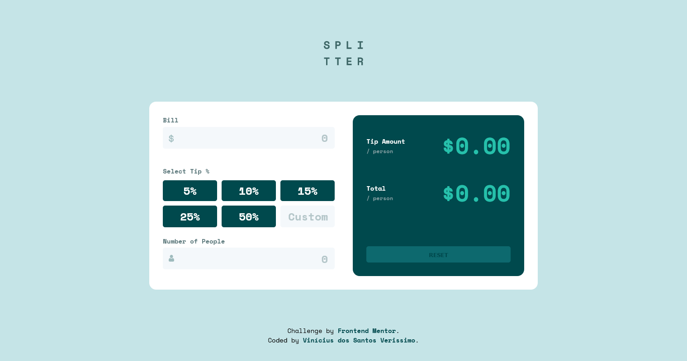

# Frontend Mentor - Tip calculator solution

## Overview

### Screenshot

### Links

- Solution URL: Working on it.

## My process

### Built with

- Semantic HTML5 markup
- CSS custom properties
- Flexbox
- Grid
- Media Queries
- JavaScript

### What I learned

In this project i could use use media queries to adapt the containers according to the screen's width and position the elements using flexbox and CSS grid.

Also, i could use JavaScript to show error messages in the form inputs and dinamically calculate the tip to each person.

## Author

- GitHub - Vinícius dos Santos Verissimo (https://github.com/viniciusdsv93)
